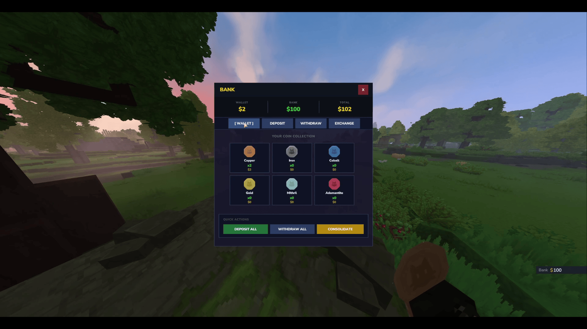
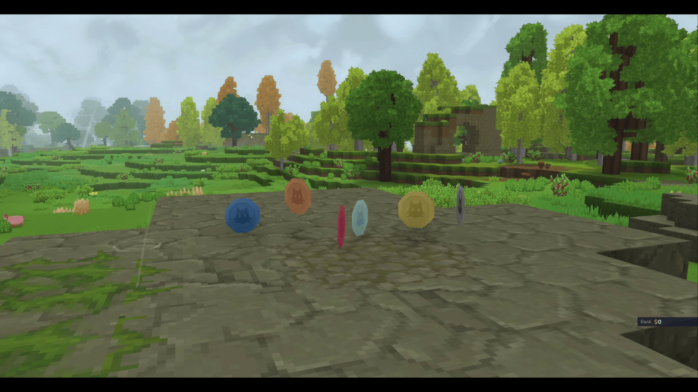

# EcotaleCoins - Physical Currency for Hytale

Physical coin items and banking system for the Ecotale economy. Players collect coins in the world and store them in the bank.


## Screenshots

### Bank GUI


### Physical Coins


## Features

### Physical Currency
- **6 coin denominations** - COPPER, IRON, COBALT, GOLD, MITHRIL, ADAMANTITE
- **World drops** - Coins drop from mobs when EcotaleJobs is installed
- **Optimal breakdown** - Large values auto-convert to highest denominations


### Bank System
- **Secure storage** - Bank balance separate from inventory coins
- **Deposit/Withdraw** - Convert between bank and physical coins
- **Exchange** - Convert between coin denominations
- **Consolidate** - Combine small coins into larger ones

### API
- Full provider API for other plugins
- Drop coins at entity positions
- Secure transaction handling

## Installation

1. Install [Ecotale](https://github.com/Tera-bytez/Ecotale) first
2. Download `EcotaleCoins-1.0.0.jar`
3. Place in your Hytale `mods/` folder
4. Start the server

### First Startup Behavior

On first installation, the plugin extracts coin assets to `mods/Ecotale_EcotaleCoins/`. This creates an asset pack that Hytale must load.

**The server will automatically restart once after extracting assets.** This is expected behavior - Hytale requires a restart to register new asset packs.

```
[EcotaleCoins] First-time setup detected. Restarting server to load assets...
```

After the restart, coins will work normally. This only happens once.

## Commands

| Command | Description | Permission |
|---------|-------------|------------|
| `/bank` | Open bank GUI | All players (Adventure mode) |
| `/bank deposit <amount\|all>` | Deposit coins to bank | All players (Adventure mode) |
| `/bank withdraw <amount\|all>` | Withdraw coins from bank | All players (Adventure mode) |

## Permissions

| Permission | Description | Default |
|------------|-------------|---------|
| `ecotale.ecotalecoins.command.bank` | Access to /bank commands | All players (Adventure mode) |

### Important: LuckPerms Override Behavior

**If you install LuckPerms**, commands will be blocked for all players until you grant permissions:

```bash
# Grant bank access to all players
/lp group default permission set ecotale.ecotalecoins.command.bank true

# Verify permission
/lp user <username> permission check ecotale.ecotalecoins.command.bank
```

---

## Customization

All coin assets are extracted to `mods/Ecotale_EcotaleCoins/` and can be modified.

### Texture Customization

Located in `Common/Items/Currency/Coins/`:

| File | Description |
|------|-------------|
| `Coin_Copper.png` | Copper coin texture (16x16) |
| `Coin_Iron.png` | Iron coin texture |
| `Coin_Cobalt.png` | Cobalt coin texture |
| `Coin_Gold.png` | Gold coin texture |
| `Coin_Mithril.png` | Mithril coin texture |
| `Coin_Adamantite.png` | Adamantite coin texture |

**To customize:** Replace any PNG with your own 64x64 texture and restart the server.

### Model Customization

| File | Description |
|------|-------------|
| `Coin.blockymodel` | Dropped coin 3D model |
| `Coin_Held.blockymodel` | Held/inventory coin model |

### Icon Customization

Located in `Common/Icons/Items/Coins/` - these appear in the inventory UI.

---

## Commands

| Command | Description |
|---------|-------------|
| `/bank` | Open the bank GUI |
| `/bank deposit <amount>` | Deposit coins to bank |
| `/bank withdraw <amount>` | Withdraw coins from bank |

## Permissions

| Permission | Description |
|------------|-------------|
| `ecotale.ecotalecoins.command.bank` | Access to /bank command |

> **Note:** This permission is **auto-generated** by Hytale's command system. You must grant it via LuckPerms for players to use the bank.

### LuckPerms Setup
```bash
# Grant bank access to all players
lp group default permission set ecotale.ecotalecoins.command.bank true
```

## Coin Values

| Coin | Base Value | Relative Value |
|------|------------|----------------|
| COPPER | 1 | 1 coin |
| IRON | 10 | 10 copper |
| COBALT | 100 | 10 iron |
| GOLD | 1,000 | 10 cobalt |
| MITHRIL | 10,000 | 10 gold |
| ADAMANTITE | 100,000 | 10 mithril |

## Configuration

> **Note:** EcotaleCoins does not have a config file. Coin values are defined in `CoinType.java` enum and cannot be changed without recompiling.

If you need configurable coin values, submit a feature request or modify `CoinType.java`:

```java
public enum CoinType {
    COPPER("Coin_Copper", 1, "Copper"),
    IRON("Coin_Iron", 10, "Iron"),
    COBALT("Coin_Cobalt", 100, "Cobalt"),
    GOLD("Coin_Gold", 1_000, "Gold"),
    MITHRIL("Coin_Mithril", 10_000, "Mithril"),
    ADAMANTITE("Coin_Adamantite", 100_000, "Adamantite");
    // ...
}
```


## API Usage

```java
import com.ecotale.api.EcotaleAPI;
import com.ecotale.api.PhysicalCoinsProvider;

// Check if coins addon is available
if (EcotaleAPI.isPhysicalCoinsAvailable()) {
    PhysicalCoinsProvider coins = EcotaleAPI.getPhysicalCoins();
    
    // Drop coins at entity position
    coins.dropCoinsAtEntity(entityRef, store, commandBuffer, 500L);
}
```

## Building from Source

**Requirements:** Place JARs in `libs/` folder:
- `hytale-server.jar` (Hytale dedicated server)
- `Ecotale-1.0.0.jar` (from Ecotale project)

```bash
./gradlew jar
```

Output: `build/libs/EcotaleCoins-1.0.0.jar`

## License

MIT License - 2026 Tera-bytez
